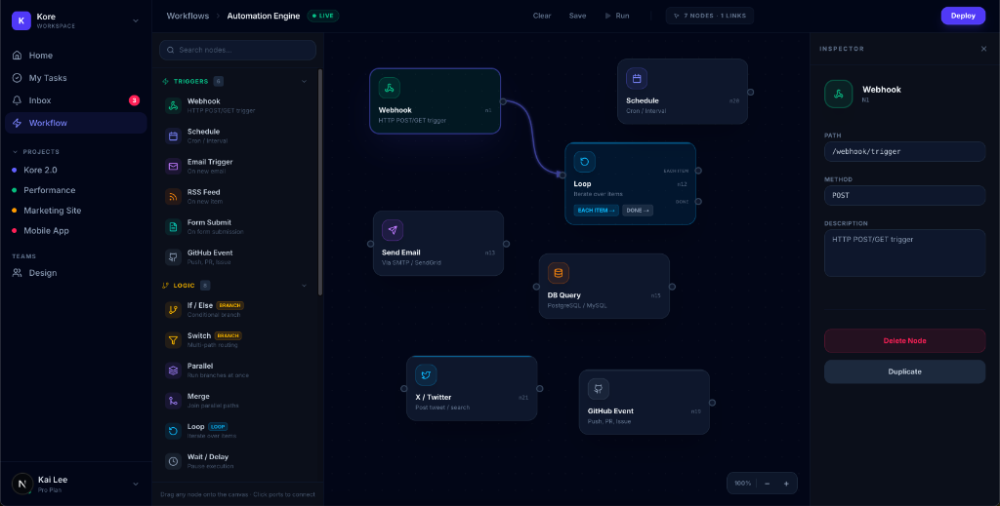

<div align="center">

# ⚡ SprintBoard

**A high-performance, dark-mode Kanban board and Automation Workflow builder.**  
Drag. Drop. Connect. Ship.



[](https://nextjs.org)
[](https://www.typescriptlang.org)
[](https://tailwindcss.com)
[](https://github.com/pmndrs/zustand)

</div>

---

## ✨ Features

- 🗂 **Kanban Board** — Three-column layout: **Todo → In Progress → Completed**
- 🖱 **Drag & Drop** — Smooth task reordering powered by `@hello-pangea/dnd`
- ⚡ **Workflow Builder** — Drag nodes onto a canvas, click ports to connect, and build complex automation logic
- 🧠 **Logic Branching** — "If/Else" and "Switch" nodes with designated **TRUE/FALSE** output ports
- 📋 **Task Details Modal** — Click any card to see full details in a beautiful slide-up panel
- 🔍 **Search & Priority Filter** — Instantly search tasks or filter by Low / Medium / High priority
- 🌑 **Dark Mode First** — Sleek `slate-950` base with indigo accents and glassmorphism UI
- 💾 **Persistent State** — All board data and workflows survive refreshes via Zustand persistence

---

## 🖼 Preview

### Automation Workflow Builder


---

## 🚀 Getting Started

### Prerequisites

- [Node.js](https://nodejs.org) v18+
- npm or yarn

### Installation

```bash
# 1. Clone the repo
git clone https://github.com/ItkalNagaratna/sprintboard.git
cd sprintboard

# 2. Install dependencies
npm install

# 3. Start the dev server
npm run dev
```

Open [http://localhost:3000](http://localhost:3000) in your browser.

---

## 🏗 Tech Stack

| Technology | Purpose |
|---|---|
| [Next.js 15](https://nextjs.org) | React framework with App Router |
| [TypeScript](https://www.typescriptlang.org) | Type-safe codebase |
| [Tailwind CSS v4](https://tailwindcss.com) | Utility-first styling |
| [Zustand](https://github.com/pmndrs/zustand) | Lightweight state management with persistence |
| [Motion](https://motion.dev) | Fluid animations and canvas interactions |
| [Sonner](https://sonner.emilkowal.ski) | Toast notifications |
| [Lucide React](https://lucide.dev) | Icon library |

---

## 🎮 Usage

| Action | How |
|---|---|
| **Create a task** | Click **+ New Task** in the Kanban header |
| **Build Workflow** | Drag a trigger/logic node from the Sidebar to the Canvas |
| **Connect Nodes** | Click an output port (circle) then click an input port |
| **Delete Link** | Click on a connection line to remove it |
| **Edit Node** | Select a node on the canvas to open the **Inspector Pane** |
| **Delete Task** | Hover a card → click the 🗑 icon |

---

## 📜 License

MIT © [Itkal Nagaratna](LICENSE)

---

<div align="center">
  Built with ❤️ using <strong>Next.js</strong> + <strong>Tailwind CSS</strong>
</div>
