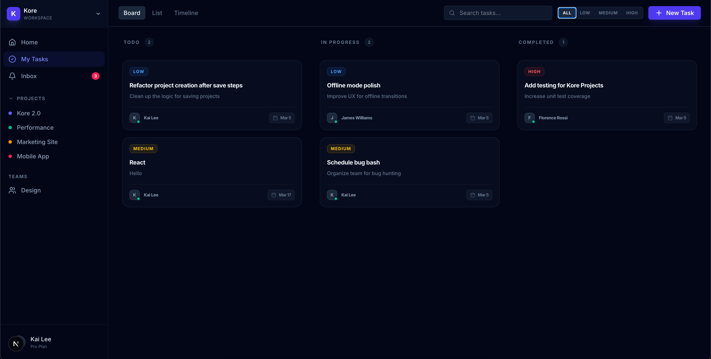

<div align="center">

# ⚡ SprintBoard

**A high-performance, dark-mode Kanban board built for modern teams.**  
Drag. Drop. Ship.



[](https://nextjs.org)
[](https://www.typescriptlang.org)
[](https://tailwindcss.com)
[](https://github.com/pmndrs/zustand)
[](LICENSE)

</div>

---

## ✨ Features

- 🗂 **Kanban Board** — Three-column layout: **Todo → In Progress → Completed**
- 🖱 **Drag & Drop** — Smooth task reordering powered by `@hello-pangea/dnd`
- 📋 **Task Details Modal** — Click any card to see full details in a beautiful slide-up panel
- 🔄 **Status Changer** — Move tasks between columns directly from the details view
- 🔍 **Search & Priority Filter** — Instantly search tasks or filter by Low / Medium / High priority
- 🗑 **Quick Delete** — Hover a card to reveal a delete button, no menus needed
- 🔔 **Toast Notifications** — Instant feedback on every action via `sonner`
- 💾 **Persistent State** — Board data survives refreshes via Zustand `persist` + localStorage
- 📱 **Fully Responsive** — Columns stack on mobile, flow side-by-side on desktop
- 🌑 **Dark Mode First** — Sleek `slate-950` base with indigo accents, glassmorphism cards

---

## 🖼 Preview


---

## 🚀 Getting Started

### Prerequisites

- [Node.js](https://nodejs.org) v18+
- npm or yarn

### Installation

```bash
# 1. Clone the repo
git clone https://github.com/YOUR_USERNAME/sprintboard.git
cd sprintboard

# 2. Install dependencies
npm install

# 3. (Optional) Set up environment variables
cp .env.example .env.local
# Add your GEMINI_API_KEY if using AI features

# 4. Start the dev server
npm run dev
```

Open [http://localhost:3000](http://localhost:3000) in your browser.

---

## 🏗 Tech Stack

| Technology | Purpose |
|---|---|
| [Next.js 15](https://nextjs.org) | React framework with App Router |
| [TypeScript](https://www.typescriptlang.org) | Type-safe codebase |
| [Tailwind CSS v4](https://tailwindcss.com) | Utility-first styling |
| [@hello-pangea/dnd](https://github.com/hello-pangea/dnd) | Accessible drag-and-drop |
| [Zustand](https://github.com/pmndrs/zustand) | Lightweight state management with persistence |
| [Motion](https://motion.dev) | Fluid animations and transitions |
| [Sonner](https://sonner.emilkowal.ski) | Toast notifications |
| [Lucide React](https://lucide.dev) | Icon library |

---

## 📁 Project Structure

```
sprintboard/
├── app/
│   ├── globals.css        # Global styles & scrollbar customisation
│   ├── layout.tsx         # Root layout with Toaster
│   └── page.tsx           # Entry point
├── components/
│   ├── board.tsx          # Main board with header, filters, DnD context
│   ├── column.tsx         # Individual Kanban column
│   ├── task-card.tsx      # Draggable task card with delete
│   ├── task-details-modal.tsx  # Read-only detail view + status changer
│   ├── task-modal.tsx     # Create / edit task form
│   └── sidebar.tsx        # Navigation sidebar (desktop + mobile drawer)
├── hooks/
│   └── use-board-store.ts # Zustand store — all board state & actions
└── lib/
    └── types.ts           # Shared TypeScript types
```

---

## 🎮 Usage

| Action | How |
|---|---|
| **Create a task** | Click **+ New Task** in the header |
| **View task details** | Click on any card |
| **Change task status** | Open details → tap a status pill |
| **Delete a task** | Hover a card → click the 🗑 icon |
| **Reorder tasks** | Drag and drop cards within or across columns |
| **Search tasks** | Use the search bar in the header |
| **Filter by priority** | Click **All / Low / Medium / High** |
| **Open sidebar on mobile** | Tap the ☰ hamburger icon |

---

## 📜 License

MIT © [SprintBoard](LICENSE)

---

<div align="center">
  Built with ❤️ using <strong>Next.js</strong> + <strong>Tailwind CSS</strong>
</div>
